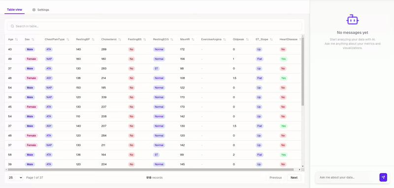

<Note title="Beta Notice">
Release v3 is currently in beta. This documentation reflects the features and functionality in progress and may change before the final release.
</Note>

PandaAI provides a [data platform](https://app.pandabi.ai) that maximizes the power of your [semantic dataframes](/v3/dataframes). 
With a single line of code, you can turn your dataframes into auto-updating AI dashboards - no UI development needed.
Each dashboard comes with a pre-generated set of insights and a conversational agent that helps you and your team explore the data through natural language.

```python
import pandasai as pai

df = pai.load("company/heart-data")
df.push()
```

The pushed datasets can then be accessed by your team-mates that can use natural language to ask questions about the data.
[](https://app.pandabi.ai)

## Auto-generated Dashboards

For each materialized dataframe, the platform automatically:
- Generates relevant questions about your data
- Creates insightful charts and visualizations
- Provides a pre-built dashboard with key insights
- Includes a conversational agent for dynamic analysis

## Conversational Data Analysis

The platform provides a powerful chat interface where your team can interact with your data using natural language. 
The conversational agent uses your [semantic layer](/v3/semantic-layer) definitions to understand business context and maintain consistency across analyses.

When you ask questions, PandaAI:
1. Uses AI to generate precise code snippets for your analysis
2. Executes the code securely within the platform
3. Returns visualizations and insights from the results

Your data never leaves the platform - the AI only generates code, while all data processing happens in your secure environment.

Ask any question about your data and:
- Get instant answers with explanatory visualizations
- Save insights as new dashboard cards

## Dynamic Analysis

Your dashboards and conversational agent stay continuously synchronized with your data sources through code execution:
- Each insight is powered by auto-generated code snippets
- Code runs on live data, ensuring results are always current
- Inherits all data cleaning and transformations defined in your [semantic layer](/v3/semantic-layer)

## Who should use the Data Platform?
Whether you're a data scientist sharing analysis with stakeholders, a business analyst creating reports, or a team leader fostering data-driven decisions, the platform makes it easy to collaborate on data analysis through our [sharing capabilities](/v3/share-dataframes).

## How to get the Data Platform?
Visit [app.pandabi.ai](https://app.pandabi.ai) to get started. 
The data platform is available as a Cloud SaaS or as an enterprise solution that can be deployed on your own cloud infrastructure with full privacy and security controls. 
