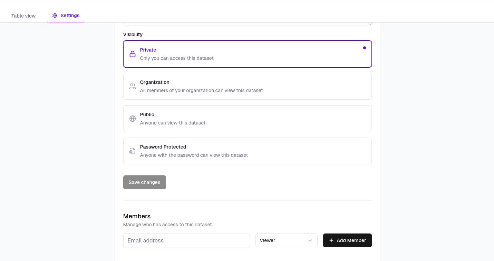

The [data platform](/v3/ai-dashboards) allows you to control how your AI dashboards and dataframes are shared and accessed. 
You can choose between four levels of access:
- Private: for your own use
- Public: for sharing with the community
- Password-protected: for controlled sharing
- Organization: for team collaboration

Each access level determines who can view and interact with your dataframes, and who consumes query quota when asking questions to the AI agent.

## Private Dataframes
Private dataframes are accessible only by their owner. When asking questions to the agent, the owner consumes their own query quota.

## Public Dataframes
Public dataframes are accessible by anyone with a PandaAI account. They are indexed on the web for discovery. When users ask questions, they consume their own query quota.

## Password-Protected Dataframes
Password-protected dataframes are accessible only by users with the correct password. When users ask questions, the dataframe owner consumes their query quota.

## Organization Dataframes
Organization dataframes are accessible by team members based on their permissions. Members can have read-only or write access. Permissions are handled in-platform by the organization owner and admins.